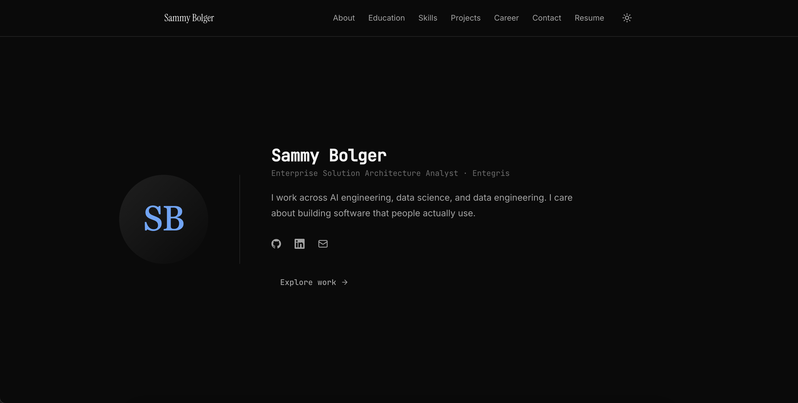
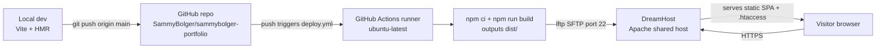

# sammybolger-portfolio

*Personal portfolio site at sammybolger.com. Static React SPA, minimalist black-and-blue design, auto-deployed to DreamHost from GitHub.*

[](https://github.com/SammyBolger/sammybolger-portfolio/actions/workflows/deploy.yml)
[](https://sammybolger.com)

The public face of my work: About, Education, Skills, Projects, Career, Contact. Built as a proper multi-page SPA (React Router, not scroll sections) with a system-wide light/dark toggle and a serif-forward typographic style. Auto-deploys to my DreamHost shared host on every push to `main`.

**Live:** [sammybolger.com](https://sammybolger.com)



---

## Overview

My personal portfolio site. A landing spot for who I am, what I work on, my career so far, my projects, and my resume. Multi-page routing (About, Education, Skills, Projects, Career, Contact) instead of one long scroll. Built to be what a recruiter or collaborator sees first, so it stays minimal, quiet, and easy to scan.

## Features

- Seven separate pages, real client-side routing via React Router
- Light and dark themes with a top-right toggle that persists via `localStorage` (dark by default, no flash-of-wrong-theme on load)
- Stagger fade-in animation on the home hero, replays on navigation
- One-page-per-topic layout (About, Education, Skills, Projects, Career, Contact) plus a resume link in the nav
- Auto-deploys to DreamHost via GitHub Actions on every push to `main`

## Screenshots / Demo


Live at [sammybolger.com](https://sammybolger.com).

## Tech Stack

- **React 19 + TypeScript** — component model and type safety
- **Vite** — dev server (HMR) and static build tool
- **React Router** — multi-page client-side routing with an SPA fallback
- **Tailwind CSS** — styling, with CSS custom properties driving the light/dark theme so both themes swap in one place
- **Framer Motion** — subtle stagger fade-ins on the hero and section reveals
- **Lucide React** — icon set for social and UI icons
- **GitHub Actions + lftp** — CI/CD pipeline that builds and SFTPs to DreamHost
- **DreamHost shared hosting + Apache** — the final home for the static build, with a `.htaccess` rewrite so client-side routes survive full-page refreshes

## Architecture



Every push to `main` fires the `deploy` workflow. The runner installs Node, `npm ci`s the deps, runs `npm run build` to produce a static `dist/`, then uses `lftp` to SFTP the whole `dist/` into `/home/sammybolger/sammybolger.com/` on the DreamHost shared server. DreamHost serves the files with Apache and the `.htaccess` rewrites any unknown path back to `index.html` so React Router handles routing client-side (`/projects` still works on a refresh).

## Project Structure

```
sammybolger-portfolio/
├── src/
│   ├── components/
│   │   ├── Nav.tsx              # top nav with theme toggle
│   │   ├── Layout.tsx           # shell that wraps every page
│   │   ├── Section.tsx          # shared section wrapper
│   │   ├── ThemeToggle.tsx      # sun/moon toggle
│   │   └── sections/            # one per page (Hero, About, Skills, ...)
│   ├── pages/                   # thin route components
│   ├── hooks/useTheme.ts        # light/dark state + localStorage
│   ├── data/content.ts          # single source of truth for all copy
│   └── assets/                  # headshot placeholder, icons
├── public/
│   ├── .htaccess                # Apache SPA fallback + cache headers
│   ├── favicon.svg              # SB monogram
│   └── resume.pdf               # linked from nav
├── .github/workflows/deploy.yml # build + SFTP to DreamHost
├── tailwind.config.js
├── vite.config.ts
└── index.html                   # inline theme script prevents FOUC
```

Content changes almost always mean editing `src/data/content.ts` and nothing else.

## Installation & Setup

**Prerequisites**
- Node 20+
- npm

**Local dev**

```bash
git clone https://github.com/SammyBolger/sammybolger-portfolio.git
cd sammybolger-portfolio
npm install
npm run dev
```

Opens at `http://localhost:5173`.

**Production build**

```bash
npm run build      # outputs dist/
npm run preview    # serves the build locally at http://localhost:4173
```

**Deploying it yourself**

If you fork this, the `deploy.yml` workflow expects one repository secret:

- `DREAMHOST_PASSWORD` — your SFTP user password

The hostname, username, and remote path are hardcoded to my DreamHost setup — swap them in `.github/workflows/deploy.yml` if you point it at a different host.

## Usage

Edit content in `src/data/content.ts`, commit, push. Every push to `main` deploys within about two minutes. Local iteration with `npm run dev` gives HMR.

## Engineering Decisions

**Multi-page SPA over single-page scroll.** The initial version was one long scroll with anchor jumps. I moved to real routes so each topic gets its own page and its own breathing room, and each URL becomes shareable and bookmarkable.

**CSS variables for theming, not Tailwind's `dark:` prefix.** Both work, but `dark:bg-x` gets repetitive across dozens of components and only handles color. Semantic CSS variables (`--bg`, `--fg`, `--muted`, `--accent`) let a single class like `bg-bg` behave correctly in either theme and make it easy to add a third theme later.

**Inline script in `index.html` to set theme before React hydrates.** Without it, dark-mode users see a light-mode flash on first paint. The three-line inline script reads `localStorage` and sets the `dark` class on `<html>` before any React code runs.

**`.htaccess` fallback instead of `HashRouter`.** Hash-based routing (`/#/projects`) would avoid the server config, but hash URLs look dated and hurt SEO. The `.htaccess` rewrite is 8 lines and gives clean paths.

**GitHub Actions + `lftp` over a third-party SFTP action.** Random Marketplace actions add supply-chain risk for a static site. `lftp` is one apt package, well-documented, and I understand every line.

**DreamHost shared hosting over Vercel/Netlify.** The domain and hosting were already paid for on DreamHost. For a small static portfolio the deploy target doesn't matter much, so I stayed on infra I own instead of introducing a new vendor.

## Limitations & Future Improvements

- No CMS. All content lives in `src/data/content.ts`, so a copy change is a code commit. Fine for me, would be tedious for a non-technical owner.
- No sitemap.xml, robots.txt, or explicit Open Graph tags yet. Search discoverability is minimal.
- Placeholder headshot. Swap for a real photo at `src/assets/headshot.svg` (or `.jpg` and update the import).
- Resume PDF at `/public/resume.pdf` is a placeholder that says "Resume coming soon." Replace with the actual file.
- No test suite. The site is small enough that TypeScript + a manual click-through covers it, but I'd add Playwright smoke tests before adding real dynamic features.

## License

[MIT](LICENSE)
